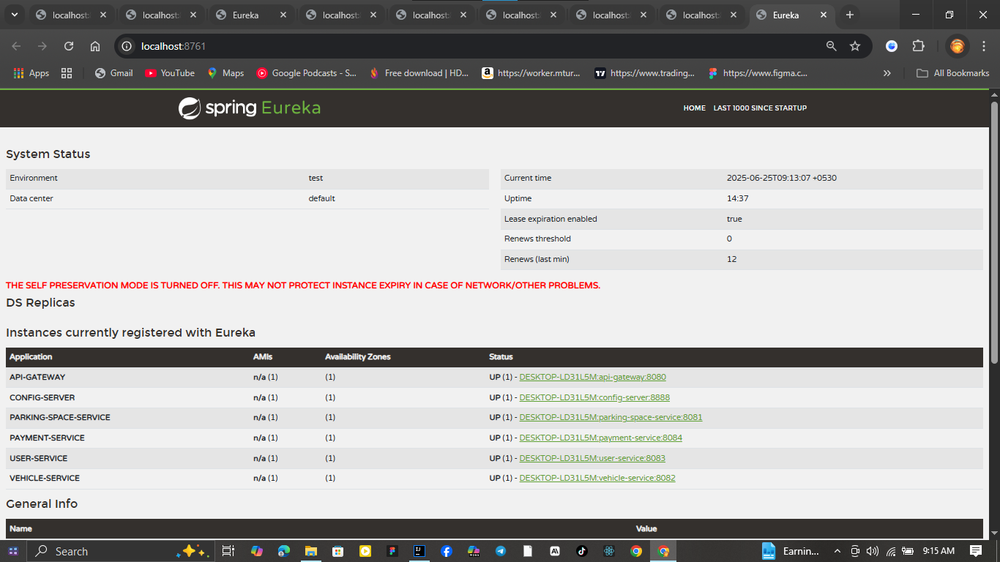

# Smart Parking Management System (SPMS)



## 📖 Overview

SPMS is a cloud-native, microservice-based platform that solves urban parking challenges by providing real-time management and monitoring of parking spaces. It serves three primary stakeholders:

* **End Users (Drivers):** Locate, reserve, and pay for parking spots.
* **Parking Owners:** Monitor and manage their parking spaces dynamically.
* **Payment Systems:** Simulate secure transactions via mock gateways.

## 🎯 Features

* **Dynamic Space Allocation:** Reserve and release parking spots in real time.
* **Availability Tracking:** Monitor spot status via manual or IoT integrations.
* **Digital Transactions:** Simulate payments and generate receipts.
* **Usage Analytics:** Track space usage by city, zone, and owner.
* **Entry/Exit Simulation:** Log vehicle entry and exit events.
* **Historical Logs:** Maintain booking history for users and admins.

## 🛠️ Architecture & Technologies

| Component             | Technology           | Purpose                                          |
| --------------------- | -------------------- | ------------------------------------------------ |
| Service Registry      | Spring Cloud Eureka  | Dynamic service discovery                        |
| Configuration Server  | Spring Cloud Config  | Centralized configuration                        |
| API Gateway           | Spring Cloud Gateway | Single entry point & routing                     |
| Parking Space Service | Spring Boot          | Manage and reserve parking spots                 |
| Vehicle Service       | Spring Boot          | Track vehicle registrations and movements        |
| User Service          | Spring Boot          | User/owner authentication and profile management |
| Payment Service       | Spring Boot          | Mock payment processing and receipt generation   |
| Testing               | Postman              | API endpoint validation                          |

## 🚀 Installation & Running

1. **Clone the repository**

   ```sh
   git clone https://github.com/orion343dream/Smart-Parking-Management-System.git
   cd SPMS
   ```
2. **Start the Config Server**

   ```sh
   cd config-server
   mvn spring-boot:run
   ```
3. **Start Eureka Service Registry**

   ```sh
   cd eureka-server
   mvn spring-boot:run
   ```
4. **Start API Gateway**

   ```sh
   cd api-gateway
   mvn spring-boot:run
   ```
5. **Start Microservices** (in separate terminals):

   ```sh
   cd parking-service
   mvn spring-boot:run

   cd vehicle-service
   mvn spring-boot:run

   cd user-service
   mvn spring-boot:run

   cd payment-service
   mvn spring-boot:run
   ```

## 🧪 Testing

* **Postman Collection:** [Postman Collection](./postman-collection.json)
* Use Postman to execute and validate all API endpoints across microservices.

## 📂 Repository Structure

```
SPMS/
├─ config-server/
├─ eureka-server/
├─ api-gateway/
├─ parking-service/
├─ vehicle-service/
├─ user-service/
├─ payment-service/
├─ postman_collection.json
├─ docs/
│  └─ screenshots/
│     └─ eureka_dashboard.png
└─ README.md
```

## 📜 License

This project is licensed under the MIT License.

---

*Developed as part of ITS 1018 – Software Architectures & Design Patterns II*
